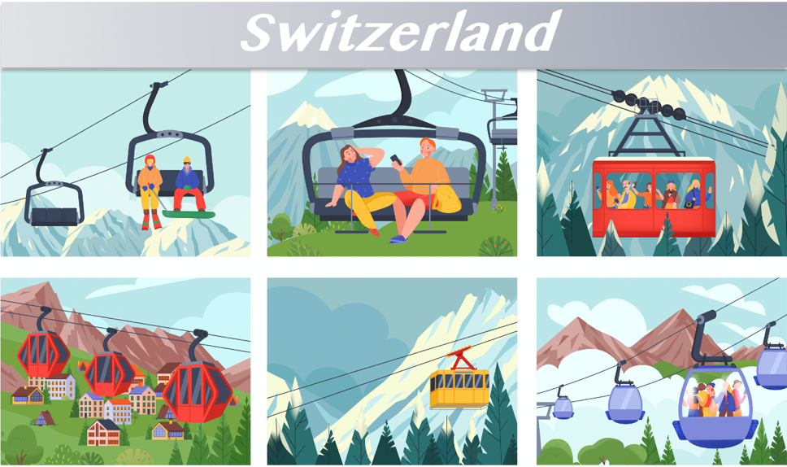

Caroline Academy organizes unforgettable educational tours to Switzerland for students at all ages across China. This includes groups in K12 through to college and university and our trips cover a range of curriculum subjects.

All of our educational tours to Switzerland will be tailored to meet the needs of the group, with state-of-the-art educational facilities and friendly, English-speaking hosts to support students throughout the duration of the trip. 

Caroline Academy is committed to supporting bilingualism as fundamental to increasing intercultural understanding and international-mindedness, as well as to providing a variety of cultural and linguistic backgrounds. We explore the crucial role language plays in communication, reflecting experience and shaping the world, and the roles of individuals themselves.

**Alpine Adventures:** Switzerland is famous for its stunning Alpine landscapes. Students can embark on mountain hikes, explore glacier formations, and enjoy breathtaking panoramic views. Activities like skiing, snowboarding, or paragliding in the Swiss Alps provide thrilling and unforgettable experiences.

 

**Cultural Immersion:** Switzerland's diverse culture offers a unique blend of influences from German, French, Italian, and Romansh traditions. Students can immerse themselves in local customs, taste regional cuisines, and participate in cultural festivals or events. Engaging with locals and experiencing their way of life fosters a deeper understanding and appreciation of Swiss culture.

 

**Visiting Historical Landmarks:** Switzerland is home to numerous historical landmarks that offer glimpses into the country's rich past. Students can explore castles, medieval towns, and ancient ruins, such as Chillon Castle, Aletsch Glacier, or the Old Town of Bern. These sites provide insights into Swiss history, architecture, and heritage.

 

**Science and Innovation:** Switzerland is known for its scientific advancements and technological innovations. Students can visit research institutions, science parks, or innovation centers to learn about cutting-edge research in fields like physics, life sciences, or renewable energy. Engaging with scientists and witnessing groundbreaking projects can inspire students' curiosity and passion for science.

 

**Environmental Education:** With its commitment to sustainability and environmental conservation, Switzerland provides excellent opportunities for students to learn about eco-friendly practices. They can visit eco-villages, renewable energy facilities, or nature reserves to understand Switzerland's efforts in preserving its natural resources and promoting sustainable living.

 

**Language Learning:** Switzerland's multilingual environment offers a fantastic opportunity for language learning. Students can practice German, French, Italian, or Romansh while interacting with locals, ordering food, or exploring markets. Language immersion programs or language exchange activities further enhance their language skills.

**International Connections:** Switzerland hosts numerous international organizations, diplomatic missions, and conferences. Students may have the chance to interact with diplomats, attend lectures or workshops, and engage in discussions on global issues. Building international connections and understanding the dynamics of global governance contribute to their global citizenship.

 

**Culinary Delights:** Swiss cuisine is a delightful fusion of flavors and influences. Students can savor famous Swiss chocolates, cheese fondue, raclette, and traditional Swiss dishes. Exploring local markets, food festivals, or culinary workshops offers a gastronomic adventure and introduces students to Swiss culinary traditions.

 

**Train Journeys:** Switzerland's efficient and scenic train system is renowned worldwide. Students can embark on picturesque train journeys, such as the Glacier Express or Bernina Express, passing through breathtaking landscapes. These journeys provide a unique perspective on Switzerland's natural beauty and engineering marvels.

 

Edutours of Switzerland provides students with a wide range of fantastic experiences, from natural wonders to cultural immersion, scientific exploration, and culinary delights. It's an opportunity for students to create lasting memories while acquiring knowledge, broadening their horizons, and fostering personal growth. 

 

Also, Edutours of Switzerland have lot of advantages:

 

**Educational Excellence:** Switzerland is renowned for its high-quality education system. Educational trips provide students with opportunities to visit prestigious institutions, engage with knowledgeable experts, and witness Swiss educational practices firsthand. They can gain insights into Switzerland's academic excellence and innovative approaches to learning.

 

**Cultural Diversity:** Switzerland is a multicultural country with multiple official languages and a rich tapestry of traditions and customs. Educational trips allow students to experience this cultural diversity, interact with people from different backgrounds, and develop a broader understanding of global perspectives.

 

**Natural Beauty and Outdoor Education:** Switzerland is known for its breathtaking landscapes, including the Swiss Alps, pristine lakes, and picturesque towns. Educational trips offer the chance to explore the country's natural beauty, engage in outdoor activities, and learn about environmental conservation. Students can participate in hiking, skiing, or nature walks while appreciating Switzerland's unique ecosystems.

 

**Global Organizations and Diplomacy:** Switzerland is home to many international organizations, including the United Nations, World Health Organization, and International Red Cross. Educational trips provide insights into global diplomacy, humanitarian efforts, and peacekeeping initiatives. Students can visit these organizations, attend lectures or workshops, and develop an understanding of Switzerland's role in international affairs.

 

**Historical and Cultural Heritage:** Switzerland has a rich historical and cultural heritage. Educational trips offer visits to historical sites, museums, and landmarks that showcase Switzerland's past. Students can learn about Swiss history, architecture, art, and influential figures, gaining a deeper appreciation for the country's cultural legacy.

 

**Science and Technology Innovations:** Switzerland is at the forefront of scientific research and technological advancements. Educational trips provide opportunities to visit research institutions, laboratories, or science museums. Students can learn about Swiss contributions to fields like physics, engineering, medicine, and environmental sustainability.

 

**Global Citizenship and Social Responsibility:** Switzerland's emphasis on social responsibility, sustainability, and humanitarian efforts aligns with fostering global citizenship among students. Educational trips can include visits to sustainable initiatives, NGOs, or community-based projects. Students can learn about Swiss values, responsible tourism, and sustainable practices, inspiring them to be socially conscious global citizens.

 

**Networking and International Connections:** Educational trips in Switzerland provide students with networking opportunities and the chance to interact with students from around the world. Collaborative activities, cultural exchanges, and discussions foster cross-cultural understanding, tolerance, and the development of lifelong connections.

 

**Personal Growth and Independence:** Educational trips promote personal growth by encouraging independence, adaptability, and resilience. Students navigate unfamiliar environments, manage their travel logistics, and engage in cultural immersion, fostering confidence, self-reliance, and a global mindset.

 

With Edutours of Caroline Academy, students will have a unique blend of academic, cultural, and outdoor experiences. Students can gain knowledge, cultural understanding, and personal growth, while also appreciating Switzerland's natural beauty and contributions to global affairs.